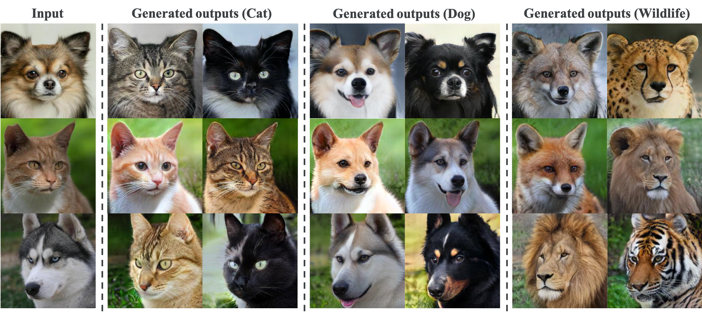

# StarGan

### Train
`python main.py --dataset celebA-HQ_gender --phase train` 

### Test 
`python main.py --dataset celebA-HQ_gender --phase test`

## Tensorflow results
CelebA-HQ

AFHQ

## Citation
`@inproceedings{choi2020starganv2,
  title={StarGAN v2: Diverse Image Synthesis for Multiple Domains},
  author={Yunjey Choi and Youngjung Uh and Jaejun Yoo and Jung-Woo Ha},
  booktitle={Proceedings of the IEEE Conference on Computer Vision and Pattern Recognition},
  year={2020}
}`
